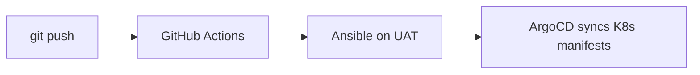

# ansible-uat

[](https://github.com/nivedmahendran/ansible-uat/actions/workflows/deploy.yml)

Production-grade UAT environment — bare metal to Kubernetes, GitOps, monitoring, and logging. Everything is defined as code and deployed automatically.

## Architecture

```
┌─────────────────────────────────────────────────────────┐
│                   GitHub Repository                      │
│  ┌──────────┐  ┌──────────┐  ┌──────────┐  ┌─────────┐ │
│  │ Ansible  │  │   K8s    │  │   Helm   │  │ ArgoCD  │ │
│  │ Playbooks│  │ Manifests│  │  Charts  │  │   App   │ │
│  └────┬─────┘  └────┬─────┘  └────┬─────┘  └────┬────┘ │
└───────┼──────────────┼──────────────┼──────────────┼─────┘
        │              │              │              │
        ▼              ▼              ▼              ▼
┌──────────────────────────────────────────────────────────────┐
│                    GitHub Actions (CI/CD)                     │
│            On push to main → ansible-playbook deploy.yml      │
└──────────────────────────────┬───────────────────────────────┘
                               │ SSH
                               ▼
┌──────────────────────────────────────────────────────────────┐
│                      UAT Server (63.250.52.122)              │
│  ┌──────────┐   ┌─────────────────────────────────────────┐ │
│  │  Docker  │   │             K3s Cluster                  │ │
│  │ Compose  │   │  ┌──────────┐  ┌──────────┐             │ │
│  │ (Legacy) │   │  │  Flask   │  │  Postgres│             │ │
│  │          │   │  │  App x3  │  │  (PVC)   │             │ │
│  │          │   │  ├──────────┤  ├──────────┤             │ │
│  │          │   │  │ Traefik  │  │  ArgoCD  │             │ │
│  │          │   │  │ Ingress  │  │  GitOps  │             │ │
│  │          │   │  ├──────────┤  ├──────────┤             │ │
│  │          │   │  │cert-man  │  │ Loki +   │             │ │
│  │          │   │  │ ager TLS │  │ Promtail │             │ │
│  │          │   │  ├──────────┤  ├──────────┤             │ │
│  │          │   │  │Prometheus│  │ Grafana  │             │ │
│  │          │   │  └──────────┘  └──────────┘             │ │
│  └──────────┘   └─────────────────────────────────────────┘ │
└──────────────────────────────────────────────────────────────┘
```

## Tech Stack

| Category | Tools |
|---|---|
| **Config Mgmt** | Ansible 14 + Ansible Vault (secrets) |
| **Container Runtime** | Docker → containerd (K3s) |
| **Orchestration** | K3s v1.35.5, Helm charts |
| **GitOps** | ArgoCD (auto-sync, auto-prune) |
| **CI/CD** | GitHub Actions (deploy on push) |
| **Ingress/TLS** | Traefik + cert-manager (self-signed CA) |
| **Monitoring** | Prometheus + Grafana (Node Exporter dashboard) |
| **Logging** | Loki + Promtail (Docker + syslog) |
| **Database** | PostgreSQL (persistent via PVC) |
| **App** | Flask + Nginx + Postgres (visitor counter) |

## Features

- **Push-button deployment** — commit to `main` triggers GitHub Actions → Ansible → server
- **GitOps** — ArgoCD watches the repo and keeps the cluster in sync
- **Auto-scaling** — 3 Flask replicas behind Traefik
- **Persistent storage** — PostgreSQL data survives pod restarts
- **Monitoring** — Prometheus scrapes metrics; Grafana preloaded with Node Exporter dashboard
- **Log aggregation** — Loki centralizes logs from all containers and syslog
- **TLS** — cert-manager issues self-signed certificates for HTTPS

## Services

| Service | URL | Credentials |
|---|---|---|
| App | https://63.250.52.122.nip.io | — |
| Grafana | https://63.250.52.122.nip.io:3000 | admin / admin |
| Prometheus | https://63.250.52.122.nip.io:9090 | — |
| ArgoCD | https://63.250.52.122.nip.io:32050 | admin / VwtBpemCLsRlgK2D |

## Project Structure

```
ansible-uat/
├── .github/workflows/deploy.yml   # CI/CD pipeline
├── app/                            # Flask app source
│   ├── app.py
│   ├── Dockerfile
│   └── requirements.txt
├── k8s/                            # Kubernetes manifests (Kustomize)
│   ├── kustomization.yml
│   ├── namespace.yml
│   ├── deployment-app.yml
│   ├── deployment-db.yml
│   ├── service-app.yml
│   ├── service-db.yml
│   ├── ingress.yml
│   ├── configmap.yml
│   ├── secret.yml
│   ├── pvc.yml
│   └── cluster-issuer.yml
├── helm-chart/                     # Helm chart (alternative deploy)
├── grafana/                        # Grafana provisioning
│   ├── datasources/datasource.yml
│   └── dashboards/
├── prometheus/prometheus.yml       # Prometheus config
├── loki/promtail.yml               # Log shipping config
├── nginx/default.conf              # Nginx reverse proxy config
├── deploy.yml                      # Ansible deployment playbook
├── docker-compose.yml              # Docker Compose stack
├── k3s.yml                         # K3s install playbook
├── certmanager.yml                 # cert-manager install playbook
├── docker.yml                      # Docker install playbook
└── argocd.yml                      # ArgoCD install playbook
```

## Deployment

Any push to `main` automatically deploys:



To deploy manually:

```bash
# Provision server
ansible-playbook -i inventory.ini docker.yml
ansible-playbook -i inventory.ini k3s.yml
ansible-playbook -i inventory.ini certmanager.yml
ansible-playbook -i inventory.ini argocd.yml

# Deploy app
ansible-playbook -i inventory.ini deploy.yml
```
